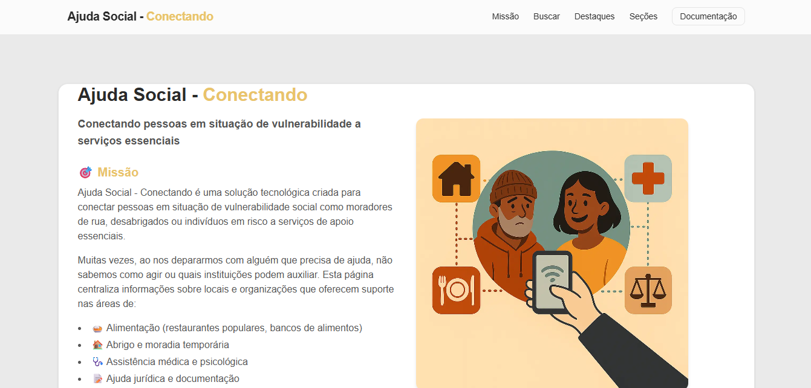
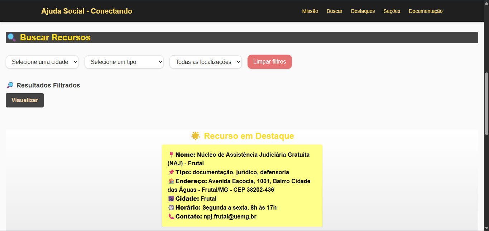
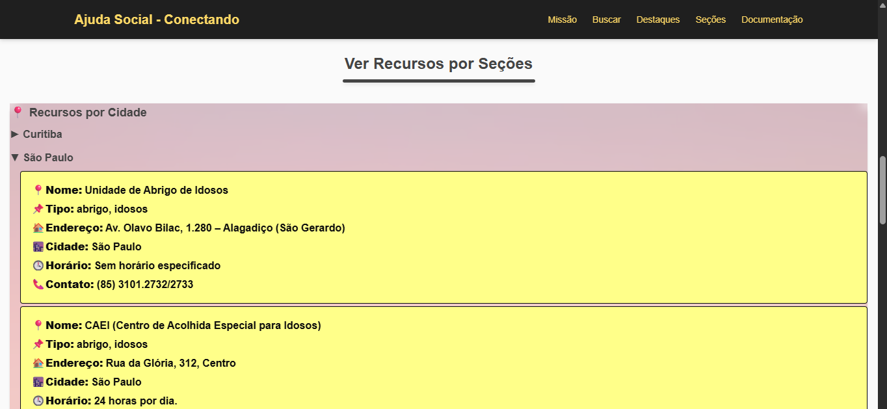
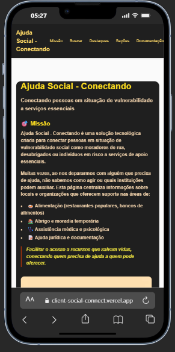
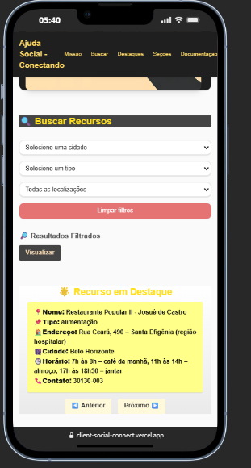
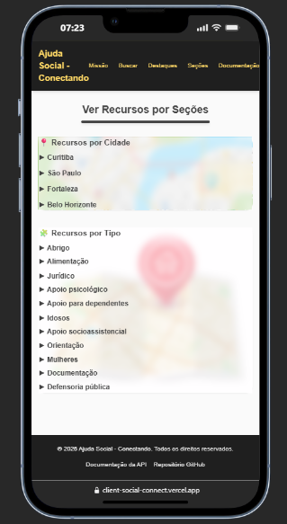

# Ajuda Social - Conectando

Este projeto foi desenvolvido como sequência do projeto backend [Ajuda Social - Conectando](https://ajudasocial-api-yxbj.onrender.com/), que está sendo consumido neste frontend. A API está disponível no repositório: [AjudaSocial_API - GitHub](https://github.com/DaihSeven/AjudaSocial_API.git).


## 🎯 Objetivo

A **Ajuda Social - Conectando** é uma solução tecnológica criada para conectar pessoas em situação de vulnerabilidade social (como moradores de rua, desabrigados ou indivíduos em risco) a serviços de apoio essenciais. Muitas vezes, ao nos depararmos com alguém que precisa de ajuda, não sabemos como agir ou quais instituições podem auxiliar. Esta API centraliza informações sobre locais e organizações que oferecem suporte em áreas como:

- 🍛 Alimentação (restaurantes populares, bancos de alimentos)
- 🏠 Abrigo e moradia temporária
- 🩺 Assistência médica e psicológica
- 📝 Ajuda jurídica e documentação

> "Facilitar o acesso a recursos que salvam vidas, conectando quem precisa de ajuda a quem pode oferecer."

## 🛠️ Tecnologias Utilizadas

- **Next.js** `15.3.3`
- **React** `19.0.0`
- **Framer Motion** `^12.23.0`
- **Tailwind CSS** `^4`
- **TypeScript** `^5`

### Dependências

```
"dependencies": {
  "framer-motion": "^12.23.0",
  "next": "15.3.3",
  "react": "^19.0.0",
  "react-dom": "^19.0.0"
},
"devDependencies": {
  "@eslint/eslintrc": "^3",
  "@tailwindcss/postcss": "^4",
  "@types/node": "^20",
  "@types/react": "^19",
  "@types/react-dom": "^19",
  "eslint": "^9",
  "eslint-config-next": "15.3.3",
  "tailwindcss": "^4",
  "typescript": "^5"
}
```

## 🚧 Passo a Passo de Criação

1. Consumir a API na página principal de forma simples (branch `v1`).
2. Criar um modelo base de layout para a landing page (link para imagem).
3. Adicionar a URL da API como variável de ambiente.
4. Criar o componente de filtro que consome diversas rotas da API.
5. Criar um formatador e componente reutilizável para os tipos:
    - `types/resource';`
    - `utils/formatType';`
6. Criar os componentes principais:
    - `CitySection`
    - `TypeSection`
    - `HighlightedCarousel`
    - `FilteredResultsSection`
7. Criar seções:
    - `MissionSection`
    - `Menu` e `Footer` (colocados no layout)
8. Estilização:
    - Ajustes de cores e espaçamentos.
    - Spinner de loading como componente reutilizável.

## ▶️ Iniciando o Projeto

```bash
npm install
npm run dev
```

Abra [http://localhost:3000](http://localhost:3000) no navegador para visualizar o resultado.

## 🔁 Uso das Rotas

- **TypeSection:** `${API_BASE_URL}/resources/type/${encodeURIComponent(type)}`
- **CitySection:** `${API_BASE_URL}/resources/city/${encodeURIComponent(city)}`
- **HighlightedCarousel:** `${API_BASE_URL}/resources`
- **FilterSection:** usa múltiplas rotas conforme filtros ativos:

```
(city && type && localization): `/resources/${city}/type/${type}/localization/${localization}`

(city && type): `/resources/${city}/type/${type}`

(city && localization): `/resources/${city}/localization/${localization}`

(city): `/resources/city/${city}`

(type): `/resources/type/${type}`

(localization): `/resources/localization/${localization}`

sem filtros: `/resources`
```
## Landing Page




## 📱 Versão Mobile

Confira uma prévia mobile da landing page:
[Web Mobile First Preview](https://www.webmobilefirst.com/en/screencasts/8tiuxn9pn4x_oj/)



